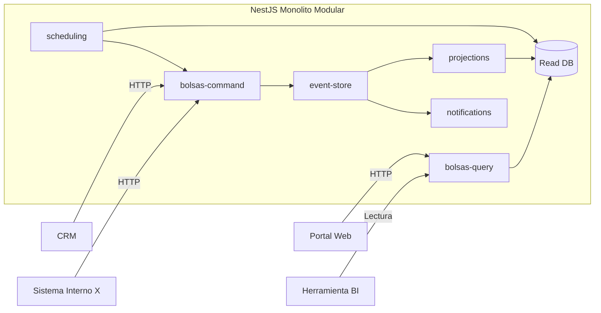

# Caso Arquitectónico: Control de Consumo de Bolsas de Facturas Electrónicas

## 1. Contexto
La compañía vende a sus clientes bolsas de consumo de facturas electrónicas. Cada cliente adquiere una bolsa con una cantidad determinada de facturas disponibles. Cada vez que el cliente emite una factura, se debe descontar una unidad de su bolsa. El negocio necesita controlar el consumo, generar alertas, permitir anulaciones y ofrecer trazabilidad completa de los movimientos.

## 2. Objetivo
Diseñar un sistema de control que permita:
- Crear bolsas a partir del cierre de un proceso comercial en el CRM.
- Consumir saldo por cada factura emitida.
- Notificar hitos relevantes de consumo y vencimiento.
- Auditar cada movimiento.
- Permitir anulaciones.
- Exponer información de consumo al portal de clientes y a herramientas de BI.

## 3. Actores y sistemas involucrados
- CRM
- Sistema de Control de Bolsas
- Sistema Interno X de emisión de facturas
- Servicio de Notificaciones
- Portal Web de clientes
- Herramienta de BI

## 4. Requerimientos funcionales
- Crear una bolsa cuando el proceso comercial finalice en el CRM.
- Consumir una unidad de bolsa cuando se emita una factura.
- Generar alertas al 80% de consumo.
- Generar alertas cuando la bolsa quede agotada.
- Generar alertas cuando falte una semana para el vencimiento.
- Permitir anular consumos.
- Mantener trazabilidad completa de cada movimiento.
- Exponer saldo e historial al portal y a BI.

## 5. Requerimientos no funcionales
- Trazabilidad completa.
- Idempotencia en consumos.
- Capacidad de auditoría.
- Escalabilidad de lectura para portal y BI.
- Separación entre operaciones de negocio y consultas.

## 6. Decisión arquitectónica
Se propone usar CQRS para separar el modelo de escritura del modelo de lectura.
Se propone usar Event Sourcing en el lado de escritura para conservar la historia completa de creación, consumo, reverso, agotamiento y vencimiento de cada bolsa.

## 7. Lado de comandos
### Comandos
- CrearBolsa
- ActivarBolsa
- ConsumirFactura
- AnularConsumo
- MarcarBolsaVencida
- GenerarNotificacionConsumo80
- GenerarNotificacionBolsaAgotada
- GenerarNotificacionVencimiento

### Reglas de negocio
- No se puede consumir una bolsa sin saldo.
- No se puede consumir una bolsa vencida.
- No se debe procesar dos veces el mismo consumo.
- Toda anulación debe quedar registrada.
- Las notificaciones deben emitirse al alcanzar los umbrales definidos.

## 8. Lado de consultas
### Queries
- ConsultarSaldoActualCliente
- ConsultarDetalleBolsa
- ConsultarHistorialConsumos
- ConsultarBolsasPorVencer
- ConsultarClientesConConsumoMayorAl80
- ConsultarReporteConsumoPorPeriodo

### Modelos de lectura / proyecciones
- SaldoClienteView
- DetalleBolsaView
- HistorialConsumosView
- AlertasBolsaView
- ConsumoBIView

## 9. Eventos de dominio
- BolsaCreada
- BolsaActivada
- FacturaConsumida
- ConsumoAnulado
- BolsaConsumidaAl80Porciento
- BolsaAgotada
- BolsaPorVencer
- BolsaVencida

## 10. Flujo principal end-to-end
1. El CRM finaliza el proceso comercial.
2. El CRM envía el comando CrearBolsa al Sistema de Control.
3. El Sistema de Control valida y registra el evento BolsaCreada.
4. La bolsa queda disponible para consumo.
5. El Sistema Interno X emite una factura.
6. El Sistema Interno X envía el comando ConsumirFactura.
7. El Sistema de Control resuelve la bolsa activa, reconstruye el estado de la bolsa, valida saldo, vigencia e idempotencia.
8. Si la operación es válida, registra el evento FacturaConsumida.
9. Las proyecciones actualizan saldo actual, historial y vistas para BI.
10. Si el consumo alcanza el 80%, se registra el evento correspondiente y se notifica.
11. Si la bolsa se agota, se registra el evento BolsaAgotada y se notifica.
12. Si falta una semana para el vencimiento, se registra el evento BolsaPorVencer y se notifica.
13. Si hay error, se ejecuta AnularConsumo y queda trazabilidad mediante ConsumoAnulado.
14. El Portal Web y BI consultan las vistas de lectura, no el Event Store.

## 11. Casos relevantes
### Caso 1: Creación de bolsa desde el CRM
Cuando el proceso comercial se cierra exitosamente, el CRM ordena la creación de la bolsa en el sistema de control.

### Caso 2: Consumo por emisión de factura
Cada factura emitida por el sistema interno X genera un consumo de la bolsa asociada al cliente.

### Caso 3: Alerta de consumo al 80%
Cuando la bolsa alcanza el 80% de consumo, el sistema genera una notificación preventiva.

### Caso 4: Bolsa agotada
Cuando el saldo llega a cero, el sistema registra el agotamiento y notifica al cliente o a las áreas correspondientes.

### Caso 5: Bolsa próxima a vencer
Cuando falta una semana para el vencimiento, se emite una alerta para prevenir afectación operativa.

### Caso 6: Anulación de consumo
Si una factura debe revertirse o hubo error, se registra una anulación manteniendo la trazabilidad.

### Caso 7: Consulta por portal y BI
Los clientes consultan saldo e historial desde el portal. BI accede a vistas resumidas para análisis y reportes.

## 12. Beneficios de la arquitectura
- Separamos claramente escritura y lectura.
- La trazabilidad queda garantizada por los eventos.
- El portal y BI consultan modelos optimizados.
- Las reglas de negocio quedan concentradas en el lado de comandos.
- El historial de movimientos permite atender reclamaciones e inconsistencias.

## 13. Trade-offs
- Mayor complejidad frente a un CRUD tradicional.
- Necesidad de proyectores y modelos de lectura.
- Posible consistencia eventual entre escritura y lectura.
- Necesidad de idempotencia y buen diseño de eventos.

## 14. Tecnologías propuestas y acercamiento técnico
Se considera la implementación sobre NestJS, implementando un monolito modular y se sugiere el uso de los siguientes modelos

## 15. Diagrama de Arquitectura

